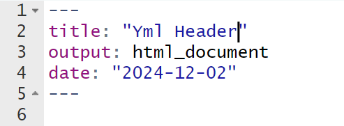
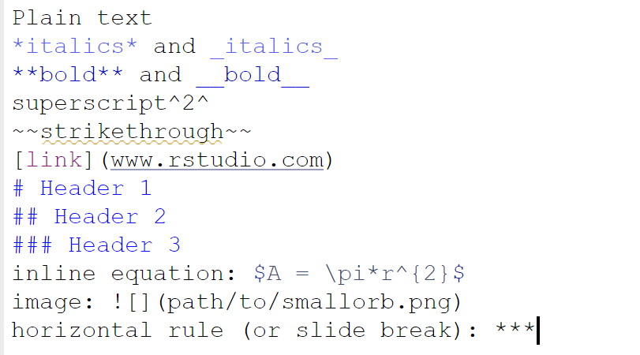
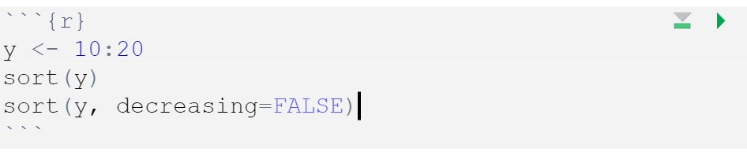
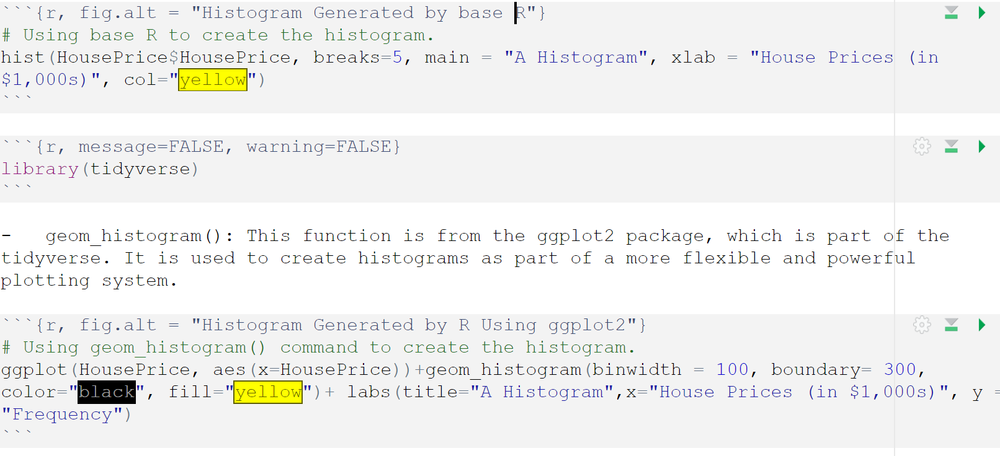

```{r setup, include=FALSE}
knitr::opts_chunk$set(echo = FALSE)
```

# Introduction to RMarkdown

-   R Markdown (RMD) files are a versatile format that combines plain text, code, and output to create dynamic and reproducible documents.
-   Benefits of Using RMD Files:
    -   Reproducibility: Combining code and output ensures that the document is reproducible. Any changes in the data or analysis can be quickly updated.
    -   Integration: RMD files seamlessly integrate with R, allowing you to run and display results from your analysis within the same document.
    -   Flexibility: You can produce various types of reports, including static documents and dynamic documents.
    -   Collaboration: Being that RMD files are plain text, they are easy to share and version control with tools like Git.
-   RMD files have many options, but generally are composed of the following:
    -   yaml Header
    -   markdown Text
    -   Code Chunks
    -   Output Formats
    -   Visualization and Plots

# yaml Header

-   The YAML header is located at the beginning of the RMD file and contains metadata about the document, such as the title, author, date, and output format. Here is an example of a YAML header:



# markdown Text

-   Markdown is a lightweight markup language with plain text formatting syntax. In an RMD file, you use Markdown to format the text, create lists, headers, links, and more. For example:



# Code Chunks

-   Code chunks allow you to embed R (or other languages) code within the document. These chunks are executed when the document is rendered, and their output is included in the final document. Code chunks are defined with triple backticks and the language, like this:



# Code output

-   Chunk output can be customized with knitr options, arguments set in the {} of a chunk header.
    -   include = FALSE prevents code and results from appearing in the finished file. R Markdown still runs the code in the chunk, and the results can be used by other chunks.
    -   echo = FALSE prevents code, but not the results from appearing in the finished file. This is a useful way to embed figures.
    -   message = FALSE prevents messages that are generated by code from appearing in the finished file.
    -   warning = FALSE prevents warnings that are generated by code from appearing in the finished.
    -   fig.cap = "..." adds a caption to graphical results.



# Output Formats

-   RMD files can be rendered into various output formats including HTML, PDF, and Word documents. The output format is specified in the YAML header. To generate the final document, you use the knit function in RStudio or call rmarkdown::render() in your R script.

# Visualization and Plots

-   RMD files can include visualizations and plots. For example, you can create and embed a plot using the ggplot2 package.

library(ggplot2) ggplot(mpg, aes(x=displ, y=hwy)) + geom_point()

```{r}

library(ggplot2)
ggplot(mpg, aes(x=displ, y=hwy)) + geom_point()

```

# Using RMD for Homework

-   You will be asked to edit an RMarkdown (.Rmd) file to process your R assignments in this course. This requires you to answer the assignment questions in .R and copy your answer to the appropriate R chunk in the .Rmd file, or answer the questions directly in the .Rmd file. To complete this process successfully, follow these steps:

    -   A .Rmd file will be linked on each applicable assignment page in Blackboard These files contain the instructions for each individual the assessment. Using RStudio, open the .Rmd file (which can be downloaded from Canvas into your working directory).
    -   Inside the .Rmd file, you will see R chunks. This is where you will put your answers. Do not delete the …{r} or the … at the end of the chunk. Those characters signifies what type of chunk you have (an R chunk) and needs beginning characters and closing characters to work.
    -   Once you complete your tasks, select knit to make the .pdf file.
    -   After you knit, you can find the .pdf file in your working directory. You can open it to verify that all of your answers are included.
    -   If your .Rmd file won't knit, you should submit your .Rmd file instead of the .pdf file. While this will cost you points on the assignment, it will still allow your instructor to evaluate the rest of the code.

# Packages Required for RMD to Work

-   RMarkdown requires updated packages for formatting and when saving as .pdf documents, a latex extension is also required so that it properly reads the formulas in the problems. Download the .R file on Blackboard and follow the instructions provided to use Blackboard. You may also watch the tutorial video on Canvas for specific information on how to set up R Markdown Files.


# Using Efficiently

To use RMarkdown most efficiently, make sure your version of R is the latest by checking the website. If it is not, then take the time to get the latest version of the software. Second, make sure your files are not on the cloud, including OneDrive. If so, then decouple at least your desktop with OneDrive so you can work off the cloud. Finally, run the lines below one at a time. Once the packages are done installing, then restart your computer. Finally, open RStudio and run a blank RMarkdown file. If this file knits, then your homework should knit as long as there are no other errors.

```{r, eval=FALSE}
install.packages("rmarkdown")
install.packages("knitr")
install.packages("formatR")
tinytex::install_tinytex()  # Select Y when/if it asks down in the console.
```


-   If you are having difficulty knitting to pdf, feel free to publish it in a .html and print the .html to a .pdf. I just ask that the final uploaded document with answers be a pdf. To do this, click the drop down arrow on the Knit option and select Knit to HTML.

# Troubleshooting RMD FIles

-   The videos on Canvas offer a walk through of how to use RMD files successfully in this course. Understanding how to use RMD files is essential to your success on assignments in this course. Please note that these videos will not show you the specific homework questions or specific answers. The files you will see in the following videos are for demonstration purposes only. Course homework assignments change regularly, so the specific contents of the files shown in the videos will likely differ from those you will see for your assignments.

-   Lack of Syntax Errors:

    -   R Markdown files may fail to knit without providing clear syntax error messages.
    -   To troubleshoot, run each code chunk interactively in RStudio to identify and fix errors before knitting.
    -   Pay attention to any warnings or messages in the console as they may indicate potential issues.

-   Using Relative Links to Datasets:

    -   If the .Rmd file relies on external datasets, ensure that file paths are specified using relative links.
    -   Relative links ensure portability, allowing the .Rmd file to work on different systems without modification.
    -   For example, if a dataset is in a subfolder, use a path like data \<- read.csv("data/my_dataset.csv").
    -   Always verify that the dataset exists in the specified location relative to the working directory.

-   Including Necessary Libraries:

    -   Functions from external libraries will fail if the required libraries are not loaded.
    -   At the beginning of the .Rmd file, load all necessary libraries explicitly using library() calls, e.g., library(tidyverse).
    -   Ensure that all libraries used in the document are installed beforehand by running install.packages() if needed.
    -   Loading libraries early prevents errors during knitting and avoids confusing error messages.

# Video 

<iframe width="560" height="315" src="https://www.youtube.com/embed/0icaDnh52Wo?si=ePQX3Pk11EJ-tcTe" title="YouTube video player" frameborder="0" allow="accelerometer; autoplay; clipboard-write; encrypted-media; gyroscope; picture-in-picture; web-share" referrerpolicy="strict-origin-when-cross-origin" allowfullscreen>

</iframe>